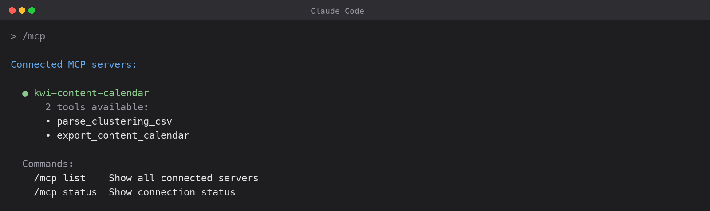
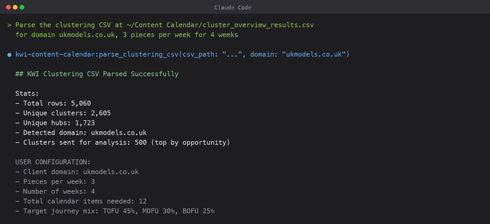
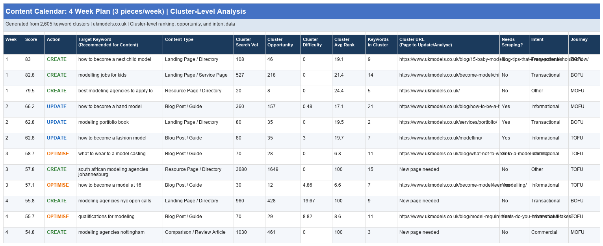
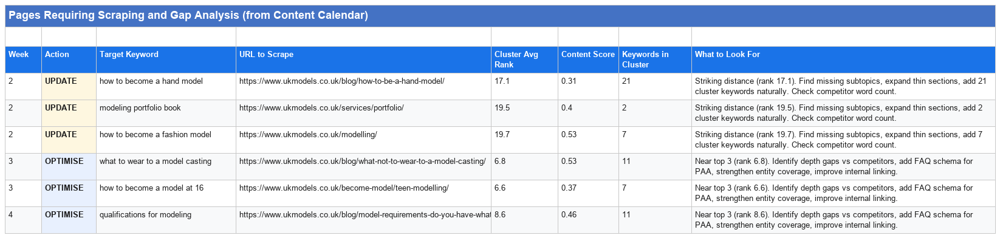
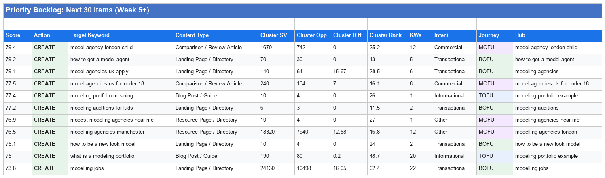
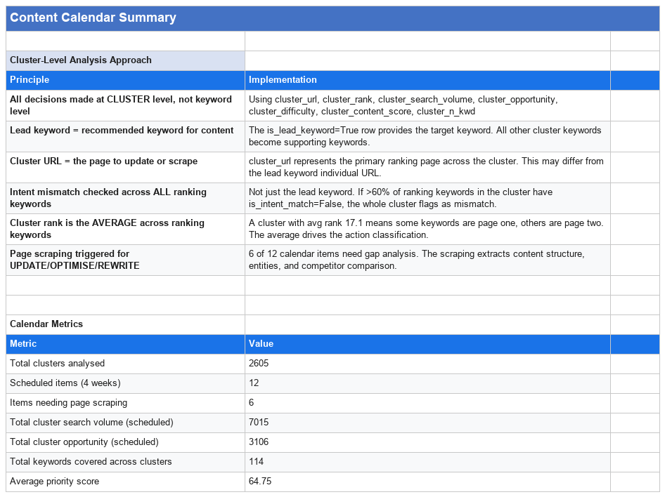
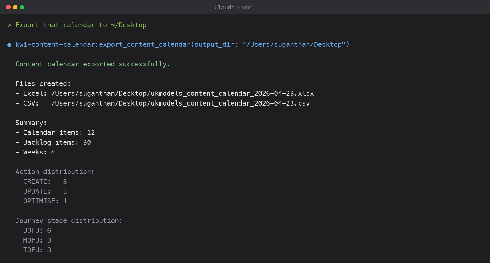

# KWI Content Calendar MCP Server

An MCP server that turns a Keyword Insights clustering CSV into a prioritised, week by week content calendar. Works with Claude Desktop, Claude Code, ChatGPT, Windsurf, Cursor, Manus AI, and any MCP-compatible tool. Your AI handles the strategic analysis. The server handles CSV parsing, cluster enrichment, and a formatted Excel export with 5 sheets.



## What it does

| # | Tool | Description |
|---|------|-------------|
| 1 | **parse_clustering_csv** | Reads a KWI clustering CSV, validates 18 required columns, compacts to top N clusters by opportunity, enriches with derived columns (mismatch counts, hub sizes, supporting keywords), and returns data with the full analysis instructions for the AI |
| 2 | **export_content_calendar** | Takes the calendar JSON that your AI generates and writes a formatted Excel workbook (5 sheets) plus a flat CSV to disk |

### What the AI receives

When `parse_clustering_csv` runs, it returns:

- **Cluster data.** Lead-keyword rows only, sorted by opportunity, capped at `max_clusters` (default 500). Each row includes cluster metrics, intent, funnel stage, hub/spoke taxonomy, and 4 derived columns: `_ranking_kw_count`, `_mismatch_count`, `_supporting_kws`, `_hub_cluster_count`
- **Analysis instructions.** A complete decision framework covering: action classification (CREATE/UPDATE/OPTIMISE/REWRITE/MAINTAIN/DEPRIORITISE), composite priority scoring (6 weighted factors plus multipliers), content type recommendation from SERP data, and calendar scheduling rules (balanced mix, funnel targets, URL consolidation, weekly sequencing)
- **User configuration.** Domain, pieces per week, weeks, and TOFU/MOFU/BOFU target percentages



### What the Excel export contains

5 formatted sheets:

| Sheet | Description |
|---|---|
| **Content Calendar** | Week by week plan with 19 columns: week, score, action, target keyword, content type, cluster metrics, cluster URL, needs-scraping flag, intent, journey, hub topic, supporting keywords, SERP features, AI Overview flag, and action rationale. Colour-coded actions, priority colour scale, frozen header, TOTALS row |
| **Gap Analysis Logic** | Documentation sheet. A 4-step playbook for what to scrape when an action is UPDATE/OPTIMISE/REWRITE: existing page signals, competitor scraping, gap calculation, and enhanced brief generation |
| **Pages to Scrape** | Filtered to UPDATE/OPTIMISE/REWRITE items with URLs, cluster avg rank, content score, keyword count, and a concrete "What to Look For" instruction per page |
| **Priority Backlog** | Next 30 clusters not in the calendar, ranked by priority score, including Hub column so you can see topical clustering |
| **Summary** | Two sections. First: six "Cluster-Level Analysis Approach" principles explaining how the calendar was built. Second: Calendar Metrics including total clusters analysed, scheduled items, items needing page scraping, total cluster search volume, opportunity, keywords covered, and average priority score |

#### Sample output

Content Calendar sheet:



Pages to Scrape with "What to Look For" instructions:



Priority Backlog with Hub column:



Summary sheet with principles and metrics:



## Setup

### 1. Clone and build

```bash
git clone https://github.com/Suganthan-Mohanadasan/kwi-content-calendar-mcp.git
cd kwi-content-calendar-mcp
npm install
npm run build
```

### 2. Configure your AI tool

**Claude Desktop** (`~/Library/Application Support/Claude/claude_desktop_config.json`):

```json
{
  "mcpServers": {
    "kwi-content-calendar": {
      "command": "node",
      "args": ["/path/to/kwi-content-calendar-mcp/dist/index.js"]
    }
  }
}
```

**Claude Code** (`~/.claude.json` under `mcpServers`):

```json
{
  "kwi-content-calendar": {
    "type": "stdio",
    "command": "node",
    "args": ["/path/to/kwi-content-calendar-mcp/dist/index.js"]
  }
}
```

**ChatGPT Desktop / Windsurf / Cursor:** Same pattern. Point your MCP config at `dist/index.js` using stdio transport.

Restart your AI tool after adding the config.

## Parameters

### parse_clustering_csv

| Parameter | Required | Default | Description |
|---|---|---|---|
| `csv_path` | Yes | | Absolute path to the KWI clustering CSV |
| `domain` | Yes | | Client domain (e.g. example.com) |
| `pieces_per_week` | No | 3 | Content pieces per week |
| `weeks` | No | 4 | Calendar duration in weeks |
| `tofu_pct` | No | 45 | TOFU (awareness) target percentage |
| `mofu_pct` | No | 30 | MOFU (consideration) target percentage |
| `bofu_pct` | No | 25 | BOFU (conversion) target percentage |
| `max_clusters` | No | 500 | Top N clusters by opportunity to analyse |

### export_content_calendar

| Parameter | Required | Default | Description |
|---|---|---|---|
| `calendar_json` | Yes | | JSON string with `calendar` and `backlog` arrays |
| `output_dir` | Yes | | Directory to save output files |
| `filename_prefix` | No | content_calendar | Prefix for output filenames |
| `total_clusters` | No | 0 | Unique clusters from the source CSV (for Summary sheet) |
| `domain` | No | "" | Client domain for the Content Calendar subtitle |
| `pieces_per_week` | No | 3 | Pieces per week used in generation |
| `weeks` | No | 4 | Calendar duration in weeks |

The AI is instructed by the analysis prompt to pass the metadata params through from the `parse_clustering_csv` stats, so the Content Calendar title and Summary sheet render correctly.



## Usage

Just talk to your AI:

- "Parse the clustering CSV at ~/Downloads/cluster_results.csv for domain example.com"
- "Analyse these clusters and build a content calendar, 3 pieces per week for 6 weeks"
- "Focus more on BOFU content: 20% TOFU, 30% MOFU, 50% BOFU"
- "Export the calendar to ~/Desktop/"
- "Show me just the week 1 priorities"
- "Which clusters have intent mismatch issues?"
- "What's in the backlog?"

## How it works

1. You provide a KWI clustering CSV (exported from [Keyword Insights](https://www.keywordinsights.ai/))
2. The server parses, validates, and compacts the CSV. 5,000 rows become ~500 enriched lead-keyword rows, roughly 33,000 tokens
3. Your AI analyses the data using the included decision framework
4. The AI produces a JSON calendar with prioritised, sequenced content items
5. The server exports to formatted Excel plus CSV

The AI handles strategy. The server handles I/O.

## The scoring model

Every cluster is scored from 0 to 100 using 6 weighted factors plus multipliers for SERP features:

| Factor | Weight | Why it matters |
|---|---|---|
| Opportunity | 25% | Estimated additional traffic if rankings improve |
| Difficulty | 20% | Lower competition means faster results |
| Rank proximity | 20% | Closer to page 1 means less effort needed |
| Intent alignment | 15% | Mismatches get urgency points |
| Funnel stage | 10% | BOFU scores highest, because BOFU converts |
| Hub size | 10% | Clusters in large topic hubs build topical authority |

Multipliers: AI Overview in SERP features applies x1.15. Featured snippet applies x1.10. Clusters with 5 or more keywords apply x1.10. Zero search volume applies x0.70.

## The action decision tree

Each cluster gets classified before it lands in the calendar or the backlog:

- **CREATE (mismatch)** if >60% of ranking keywords have the wrong page type
- **MAINTAIN** if cluster avg rank is top 5 (skipped from the calendar, lives in the backlog)
- **OPTIMISE** if cluster avg rank is 6 to 15
- **UPDATE** if cluster avg rank is 16 to 30, or 31 to 60 with a content score above 0.4
- **REWRITE** if cluster avg rank is 31 to 60 with a content score under 0.4, or 61 plus
- **CREATE (quick win / strategic / gap fill)** if not ranking and opportunity or difficulty conditions fire
- **DEPRIORITISE** if not ranking, low opportunity, high difficulty

Week 1 is reserved for intent mismatches. Week 2 for striking distance updates. Week 3 mixes quick wins with page 1 optimisations. Week 4 onwards picks up balanced fill with journey stage constraints applied.

## Getting a clustering CSV

1. Sign up at [keywordinsights.ai](https://www.keywordinsights.ai/)
2. Create a clustering project with your keyword list
3. Run the clustering
4. Export results as CSV

The export includes all required columns: cluster metrics, intent classifications, funnel stages, hub/spoke taxonomy, SERP features, and ranking data.

## Blog post

Full walkthrough with screenshots and use cases: [keywordinsights.ai/blog/ai-content-calendar-mcp/](https://www.keywordinsights.ai/blog/ai-content-calendar-mcp/)

## License

MIT
